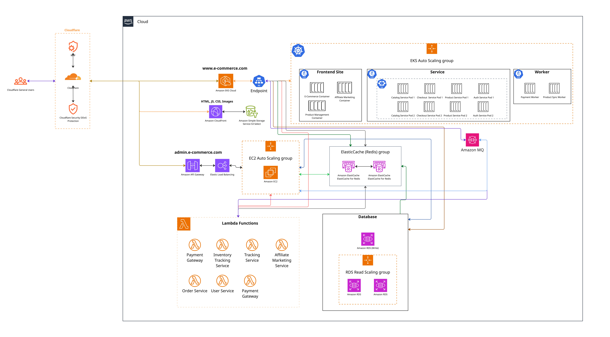

# E-Commerce Platform Cloud Architecture

This architecture diagram depicts a highly available, cloud-native e-commerce platform leveraging AWS managed services, Kubernetes (EKS), serverless computing, and robust caching and messaging layers. Below is a detailed breakdown of the components and their interactions:

---

## 1. Edge Security & Content Delivery

- **Cloudflare**
  - All external user traffic is routed through Cloudflare, providing DDoS protection and general edge security.
  - Ensures secure, reliable access for both customers and administrators.

- **Amazon CloudFront & S3**
  - Static assets (HTML, JS, CSS, images) are served from CloudFront, with S3 as the origin, ensuring low-latency static content delivery.

---

## 2. Application Entry Points

- **e-commerce.com**
  - The main customer-facing website.
  - Traffic flows through Cloudflare, then to AWS S3 (static assets) or to dynamic endpoints as required.

- **admin.e-commerce.com**
  - Dedicated admin portal.
  - Requests are routed through Amazon API Gateway and Elastic Load Balancer before reaching an EC2 Auto Scaling Group for backend admin services.

---

## 3. Compute Layer

### Kubernetes (EKS) Auto Scaling Group

- **Frontend Site**
  - Contains containers for the e-commerce web frontend, affiliate marketing, and product management.

- **Service**
  - Microservice pools for core business logic:
    - Catalog Service (multiple pods for HA and scaling)
    - Checkout Service (multiple pods)
    - Product Service (multiple pods)
    - Authentication Service (multiple pods)
  - Each microservice is deployed as multiple pods, enabling high availability and elasticity.

- **Worker**
  - Dedicated Kubernetes worker pods for asynchronous tasks:
    - Payment Worker
    - Product Sync Worker

---

## 4. Backend for Admin Portal

- **EC2 Auto Scaling Group**
  - Scalable group of EC2 instances serving the admin portal, protected by an Elastic Load Balancer and managed via API Gateway.

---

## 5. Serverless Layer

- **Lambda Functions**
  - Implements event-driven, serverless business logic for:
    - Payment Gateway
    - Inventory Tracking Service
    - Tracking Service
    - Affiliate Marketing Service
    - Order Service
    - User Service
  - Allows for rapid scaling and efficient handling of asynchronous or event-based workflows.

---

## 6. Caching Layer

- **Amazon ElastiCache (Redis) Group**
  - Provides distributed in-memory caching to accelerate reads and reduce database load.
  - Used by both EKS services and the admin backend for fast data access.

---

## 7. Messaging & Background Processing

- **Amazon MQ**
  - A message broker for reliable asynchronous communication and background job processing.
  - EKS worker pods and other backend services consume messages for tasks such as payment processing and product synchronization.

---

## 8. Data Layer

- **Amazon RDS (Relational Database Service)**
  - **Primary (Write) Node:** All write operations are directed here.
  - **RDS Read Scaling Group:** Multiple read replicas are used for scaling read queries and enhancing availability and performance.
  - Ensures data durability, backup, and failover support.

---

## 9. Data Flow Overview

1. **Users** access the e-commerce or admin sites via Cloudflare, which then routes requests to the AWS infrastructure.
2. **Static content** is served from CloudFront/S3.
3. **Dynamic requests** are handled by EKS microservices or the admin EC2 backend, depending on the endpoint.
4. **Microservices** interact with the database, cache, and message broker for efficient data processing and asynchronous workloads.
5. **Serverless Lambda functions** handle specific business events and processes.
6. **Background workers and message queues** ensure heavy tasks are processed efficiently and reliably.

---

## 10. Key Architectural Benefits

- **Security:** DDoS protection, API Gateway controls, and AWS IAM.
- **Scalability:** Auto-scaling at every layer—Kubernetes, EC2, RDS, and serverless.
- **Performance:** Distributed caching and read scaling.
- **Reliability:** Redundancy through multi-pod, multi-instance, and multi-replica deployments.
- **Separation of Concerns:** Decoupled microservices, asynchronous processing, and serverless event handling.

---

_This architecture is robust, maintainable, and designed for high-traffic, enterprise-grade e-commerce solutions._
