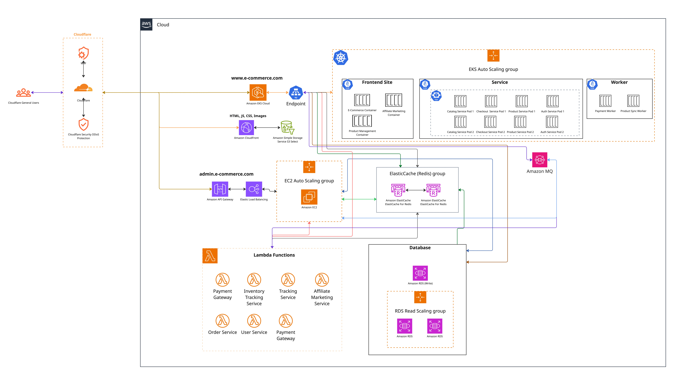

# DevOps Challenge: API Development, Deployment & System Architecture

## Table of Contents
1. [Project Overview](#project-overview)
2. [File Structure](#file-structure)
3. [REST API](#rest-api)
4. [Dockerization](#dockerization)
5. [CI/CD Pipeline](#cicd-pipeline)
6. [Infrastructure as Code (Terraform)](#infrastructure-as-code-terraform)
7. [Kubernetes Manifests](#kubernetes-manifests)
8. [Setup Instructions](#setup-instructions)
9. [Architecture Diagram](#architecture-diagram)
10. [Design & Reasoning](#design--reasoning)

---

## Project Overview

This project demonstrates a scalable, cloud-native e-commerce application, focusing on modern DevOps best practices:

- **REST API** for weather forecast functionality.
- **Docker** for containerization.
- **CI/CD** for automated build, and deployment to eks cluster.
- **Terraform** for cloud infrastructure provisioning.
- **Kubernetes** for Kubernetes manifest files.

---

## File Structure

```plaintext
Part A: Develop & Deploy a REST API/
├── Kubernetes
│   ├── readme.md
│   ├── ingress
│   │   └── readme.md
│   ├── nginx
│   │   └── deployment.yml
│   ├── sigNoz
│   │   ├── readme.md
│   │   └── values.yaml
│   └── weather_forecast_api
│       ├── deployment.yml
│       ├── images
│       │   ├── api-health.png
│       │   └── api-hello.png
│       └── readme.md
├── terraform
│   ├── main.tf
│   ├── modules
│   │   ├── eks
│   │   │   ├── main.tf
│   │   │   ├── outputs.tf
│   │   │   └── variables.tf
│   │   └── vpc
│   │       ├── main.tf
│   │       ├── outputs.tf
│   │       └── variables.tf
│   ├── outputs.tf
│   ├── readmd.md
│   ├── terraform.tfstate
│   ├── terraform.tfstate.backup
│   └── variables.tf
└── weather-forecast-api
    ├── _test_
    │   ├── health.test.js
    │   └── hello.test.js
    ├── docker-compose.yml
    ├── Dockerfile
    ├── http
    │   ├── api_health.http
    │   └── api_hello.http
    ├── package-lock.json
    ├── package.json
    ├── routes
    │   └── api.js
    └── server.js
```

```plaintext
Part B: System Architecture Design/
├── image
│   └── diagram.jpg
└── readme.md
```


## REST API

The backend is implemented using Node.js/Express.

This REST API integrates with an external weather data provider, [WeatherAPI](https://www.weatherapi.com/), to fetch real-time weather information.

---

##### Service Endpoint

- **API URL:**  
  ```
  http://api.weatherapi.com/v1/current.json
  ```

##### Purpose & Usage

- The WeatherAPI service is used to retrieve current weather data for specified locations.
- The API is integrated within our backend to power weather-related features and display up-to-date conditions to users.

##### Example Request

```http
GET http://api.weatherapi.com/v1/current.json?key=<YOUR_API_KEY>&q=London
```

- Replace `<YOUR_API_KEY>` with your valid WeatherAPI access key.
- `q` parameter specifies the location (e.g., city name).

### Main Endpoints

| Endpoint          | Method | Description                 |
|-------------------|--------|-----------------------------|
| `/forecast/:city` | GET    | Selected city forecast      |
| `/hello`          | GET    | Get dhaka forecast details  |
| `/health`         | GET    | Health Check Endpoint       |

See [API Documentation](Part_A_Develop_and_Deploy_REST_API/weather-forecast-api/docs/api.md)

---

## Dockerization

The application is containerized using Docker for consistency across environments. Also given docker compose build and development purpose

**Key Dockerfile elements:**
- Node.js Alpine image for a smaller images
- Non-root user for security

See [Dockerfile](Part_A_Develop_and_Deploy_REST_API/weather-forecast-api/Dockerfile).

See [Docker Compose](Part_A_Develop_and_Deploy_REST_API/weather-forecast-api/docker-compose.yml).

---

## CI/CD Pipeline

Continuous Integration and Deployment is managed via GitHub Actions.

- **Build:** Build Docker image on each push.
- **Deploy:** On merge to `main`, deploy to Kubernetes via `kubectl`.

See [CI/CD config](Part_A_Develop_and_Deploy_REST_API/weather-forecast-api/.github/workflows/publish.yml) for the pipeline definition.

---

## Infrastructure as Code (Terraform)

Terraform scripts provision:

- Managed Kubernetes Cluster
- VPC, Subnets, Route Table (Public and Private), EKS
- IAM roles and service accounts

See [Terraform](Part_A_Develop_and_Deploy_REST_API/terraform/) directory.

---

## Kubernetes Manifests

Kubernetes YAMLs for:

- nignx deployments
- ingress deployment
- sigNoz deployment
- weather forecast API deployment

See [Kubernetes YAMLs and ReadME](Part_A_Develop_and_Deploy_REST_API/Kubernetes) directory.

---

## Setup Instructions

1. **Clone the repository**
   ```bash
   git clone https://github.com/arn-ob/DevOps_Shajidur.git
   cd DevOps_Shajidur
   ```
2. **Build and Developing Applicatiomn**
   ```bash
   docker compose up --build
   ```
3. **Run locally**
   ```bash
   docker run -p 3000:3000 weather_forecast_api
   ```
4. **Provision Cloud Infrastructure**
   ```bash
   cd Part_A_Develop_and_Deploy_REST_API/terraform
   terraform init
   terraform plan
   terraform apply
   ```
5. **Deploy Service to Kubernetes**
   Follow the README [Kubernetes README](Part_A_Develop_and_Deploy_REST_API/Kubernetes/readme.md) directory.

---

## Architecture Diagram



*The architecture supports horizontal scaling, high availability, and automated deployment to Kubernetes clusters.*

---

## Design & Reasoning

- **Microservices-ready:** Modular codebase for future decomposition.
- **Cloud-native:** Uses managed services and infrastructure-as-code for reproducibility.
- **Security:** Follows least-privilege in IAM, uses secrets for sensitive data.
- **Scalability:** Kubernetes enables auto-scaling and rolling deployments.
- **Observability:** Logs and metrics exposed for monitoring.
